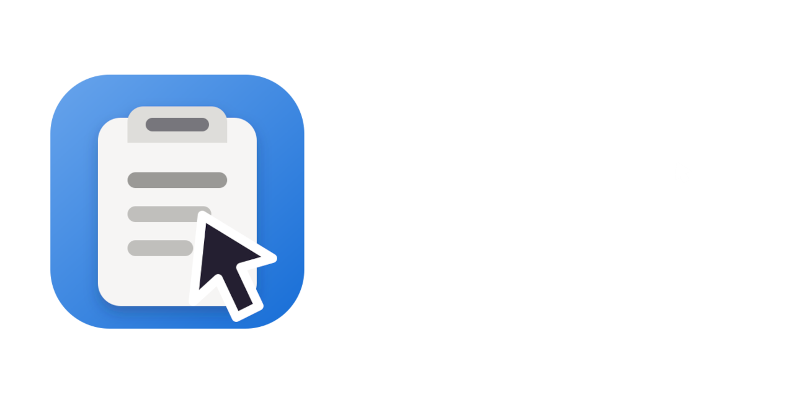

# Cursor Clip - GTK4 Clipboard Manager with Dynamic Positioning
<div align="center">
  <a href="https://github.com/Sirulex/cursor-clip">
    
  </a>
</div>

A modern Wayland clipboard manager built with **Rust**, **GTK4**, **Libadwaita**, and **Wayland Layer Shell** that makes clipboard handling more reliable.
Features a Windows 11–style clipboard history interface with native GNOME design, which is always positioned at the current mouse pointer location.

## Features


<div style="margin-right: 400px;">

### 📋 **Windows 11-Style Clipboard History**
- **Clean list interface**: Similar to Windows 11 clipboard history
- **Content type indicators**: Icons for text, URLs, code, files, etc.
- **Rich previews**: Formatted content display for text, images, and file paths
- **Timestamps**: When each item was copied
- **Quick selection**: Click any item to copy it back to the clipboard
- **Search and filter**: Live search through clipboard history
- **Pin or delete items**: Manage your history with ease
- **Instant paste**: Option to immediately paste the selected item into the active application
- **Persistent history**: Option to store clipboard history across sessions with automatic encryption

### 🖱️ **Advanced Wayland Integration**
- **Layer Shell Protocol**: Proper overlay positioning above all windows
- **Precise Cursor Tracking**: Real-time mouse position detection
- **Multi-output Support**: Works across multiple monitors
- **Multi-input Support**: Fully controllable with mouse and keyboard

### 🎨 **Native GNOME Design**
- **Libadwaita styling**: Follows GNOME Human Interface Guidelines
- **Native widgets**: HeaderBar, ListBox, ScrolledWindow
- **Dynamic theming**: Adapts to light/dark mode and system accent colors

### 📂 **Automatic Clipboard Monitoring (Wayland)**
- Stores copied items in memory or in a persistent database and removes duplicates.
- Automatic classification of content types:
  - 📝 Text
  - 🔗 URLs
  - 💻 Code
  - 🔒 Passwords
  - 📁 File paths
  - 🖼️ Images

</div>

### 🎥 **Video Showcase**
   <video src="https://github.com/user-attachments/assets/387c6441-fa6f-4d63-bea8-96d0eece85ee" >
      Your browser does not support the video tag. You can watch it here:
      <a href="https://github.com/user-attachments/assets/387c6441-fa6f-4d63-bea8-96d0eece85ee">Video link</a>.
   </video>

## Compositor Support
   - The backend uses `zwlr_data_control_manager_v1` to automatically monitor and set clipboard content.
   - The frontend uses `zwlr_layer_shell_v1` to retrieve pointer coordinates and show the overlay.
   - Supported compositors (must support both protocols):
     - KDE Plasma (Wayland session)
     - Hyprland
     - Sway
     - niri
     - Labwc
     - Other wlroots-based compositors

   - Although the application uses GNOME styling and follows the GNOME HIG, GNOME Shell is unfortunately **NOT SUPPORTED**. It does not implement the required Wayland protocols (`zwlr_layer_shell_v1` and `zwlr_data_control_manager_v1`) needed for Cursor Clip's key features. Future support is not impossible but will require major code and workflow changes and a separate GNOME Extension.

### System Requirements
- **Wayland compositor**, **GTK4**, **gtk4-layer-shell**, **libadwaita**, **Rust**

## Installation on Arch Linux based distributions via AUR
You can install the prebuilt Cursor Clip binary from the AUR using an AUR helper like `yay`:
```bash
yay -S cursor-clip-bin
```
or use the `cursor-clip-git` package to build from source:
```bash
yay -S cursor-clip-git
```

## Building and Installing the Flatpak
Flathub release is in the works, but you can build and install the Flatpak locally from the manifest file.
The Flatpak manifest builds Cursor Clip and all non-runtime dependencies from source (requires flatpak-builder):

```bash
flatpak run --command=flathub-build \
  org.flatpak.Builder \
  --install -y \
  io.github.sirulex.cursor-clip.yml
```

Run the clipboard monitor and overlay with:

```bash
flatpak run io.github.sirulex.cursor-clip --daemon
flatpak run io.github.sirulex.cursor-clip
```

The default launcher starts the monitor automatically if it is not already
running. For a complete workflow, add the daemon command to your compositor's
autostart configuration and bind the second command to a shortcut such as
Super+V.


## Manual Building

### Install Dependencies

#### Arch Linux:
```bash
sudo pacman -S gtk4 libadwaita gtk4-layer-shell
```

#### Ubuntu/Debian:
```bash
sudo apt update
sudo apt install build-essential pkg-config libgtk-4-dev libadwaita-1-dev libgtk4-layer-shell-dev
```

#### Fedora:
```bash
sudo dnf install gtk4-devel libadwaita-devel gtk4-layer-shell
```


### Download and Compile

```bash
# Clone the repository
git clone https://github.com/Sirulex/cursor-clip
cd cursor-clip

# Build in release mode
cargo build --release
```

## Building with Docker

Build a containerized version that includes all dependencies:

```bash
# Build the Docker image and install the binary
docker build -t cursor-clip .
docker create --name cursor-clip-temp cursor-clip
sudo docker cp cursor-clip-temp:/output/cursor-clip /usr/local/bin/
sudo docker cp cursor-clip-temp:/output/libgtk4-layer-shell.so* /usr/local/lib/
docker rm cursor-clip-temp

# Update library cache and run
sudo ldconfig
cursor-clip --daemon
```

## Building with Nix Flake

```bash
# Build and install using Nix Flakes (default package)
nix build .
# or: nix build .#default
sudo cp result/bin/cursor-clip /usr/local/bin/

# Optional: enter the development shell
nix develop
```

## Usage
1. **Start Background Daemon**: `cursor-clip --daemon`
2. **Toggle Overlay**: Run `cursor-clip` without any arguments to open and close it (ideally bind it to a hotkey, e.g., Super+V)
3. **Trigger**: Your mouse position is automatically captured
4. **View History**: The clipboard history window will appear at your cursor position, showing:
   - **Recent clipboard items** with content previews
   - **Content type icons** (text, URL, code, password, file)
   - **Timestamps** showing when items were copied
   - **Quick actions**: Clear All, Delete, Pin and Close
5. **Interact**:
   - **Click any item** to copy it back to the clipboard
   - **Scroll** through your clipboard history
   - **Clear All** to remove all history items
   - **Delete** to remove a single item from history
   - **Pin** to keep an item permanently at the top of the list
   - **Search**: Press the search icon or `/` on your keyboard to focus the search field and filter clipboard items live by preview text or content type
   - **Search actions**: Press `Enter` to paste the currently selected filtered result; press `Esc` to leave the search field and continue navigating the filtered list; press `Up`/`Down` to move into the filtered results; press `Ctrl+U` to delete everything before the cursor in the search field
   - **Keyboard navigation**: Use `Arrow keys` or `J/K` to navigate, `Enter` to select, `Delete` to remove, `P` to pin, `Esc` to close the overlay when the search field is not focused
   - **Three-dot menu** on the window header allows you to toggle **Delete**/**Pin** button visibility, instant paste and persistent history (config stored permanently in `~/.config/cursor-clip/config.toml`)

## Persistent History Security

If persistent history is enabled, clipboard history is stored in an encrypted local database. The database key is stored in your operating system keyring and reused on restart. This ensures that your clipboard history remains secure and private, even if someone gains access to your filesystem (e.g., sidechannel attacks). The encryption and key management are handled automatically by Cursor Clip, so you can enable persistent history with just a simple toggle.

## Instant paste note:
On KDE Plasma, instant paste is currently not available because the compositor does not provide `virtual-keyboard-unstable-v1` protocol support. See compositor support details at the bottom of: https://wayland.app/protocols/virtual-keyboard-unstable-v1

```
┌─────────────────────────────────────────────────┐
│                 Cursor Clip                     │
├─────────────────────────────────────────────────┤
│  GTK4 + Libadwaita UI Layer                     │
│  ├── Modern styling with CSS                    │
│  ├── Responsive layouts                         │
│  └── Accessibility features                     │
├─────────────────────────────────────────────────┤
│  Wayland Layer Shell Integration                │
│  ├── zwlr_layer_shell_v1 protocol               │
│  ├── Positioning and anchoring                  │
│  └── Overlay layer management                   │
├─────────────────────────────────────────────────┤
│  Clipboard Management                           │
│  ├── Data Control Manager for privileged access │
│  ├── IPC communication via UNIX domain sockets  │
│  ├── IndexMap for clipboard history storage     │
│  └── Stoolap for persistent history storage     │
└─────────────────────────────────────────────────┘
```

## Dependencies

### Core Libraries
- **GTK4**: Modern UI toolkit
- **Libadwaita**: GNOME's design system
- **gtk4-layer-shell**: Wayland layer shell integration
- **wayland-client**: Wayland protocol bindings
- **wayland-protocols**: Extended Wayland protocols
- **wayland-protocols-wlr**: wlroots-specific Wayland protocols
- **Tokio runtime**: Asynchronous runtime
- **serde**: Serialization framework
- **indexmap**: Ordered map for clipboard history
- **fast_image_resize**: Efficient image resizing for previews
- **keyring**: Secure storage for encryption keys
- **stoolap**: Encrypted local database for persistent history
- **env_logger**: Logging framework
---

**Built with ❤️ using Rust, GTK4, Libadwaita, and Wayland Layer Shell**

## Support
If you find this project useful and would like to support its development, consider sponsoring me on GitHub or Ko-fi. Your support helps me dedicate more time to improving and maintaining Cursor Clip.
- GitHub Sponsors: https://github.com/sponsors/Sirulex
- Ko-fi: https://ko-fi.com/sirulex

## License

This project is licensed under the GNU General Public License v3.0 (GPL-3.0). See `LICENSE` for the full text.
